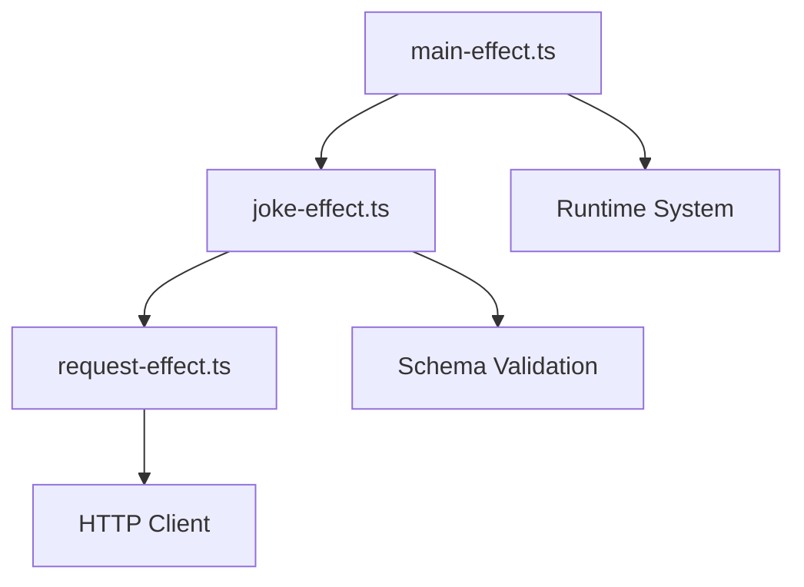

<div class="flex items-center justify-center">
  
</div>

<div class="flex flex-col items-center justify-center text-center gap-8">

# An Introduction to Production-Grade TypeScript with Effect

The TypeScript library for composable, type-safe, context-aware programs.

</div>

<!--
- This is an introduction to Effect, a powerful library for TypeScript
- Effect is designed to help us build robust, production-grade applications
- It addresses common pain points in TypeScript development
-->

---

# Why TypeScript?

Typescript is becoming the de-facto standard for writing web applications, both frontend and backend.

- It's one of the most popular programming languages in the world
- It's a superset of JavaScript, so you can use JavaScript in your TypeScript code
- It provides static typing, which helps catch errors early and improves code quality

<!--
- TypeScript adoption continues to grow rapidly in the industry
- According to recent surveys, it's one of the most loved languages
- It builds on JavaScript, so the learning curve isn't steep for JS developers
- The static typing helps catch errors before runtime, improving code quality
- However, TypeScript still has significant limitations
-->

---
transition: slide-up
---

# JavaScript's Missing Features


<!--
- This slide shows results from the State of JavaScript 2023 survey
- Developers consistently cite these missing language features as pain points
- Note the high demand for a standard library, the pipe operator, immutable data structures, and observability
-->

---

# JavaScript's Missing Features


<!--
- Take note of code architecture, state management and async code
- TypeScript helps with some issues but doesn't solve fundamental problems in the language
- There's a clear desire for better tools for managing complexity and errors
- Effect addresses these pain points
-->

---

# The Missing Piece: What is Effect?

Effect is a powerful TypeScript library that gives developers a complete ecosystem for building reliable applications.

- 🧠 **Typed Effects** – Track success, failure, and dependencies in a single type: `Effect<A, E, R>`
- 🛡️ **Type-Safe Errors** – Handle failures explicitly and exhaustively
- 🧩 **Composable Design** – Build programs from small, declarative units
- ⚙️ **Dependency Injection** – Type-safe contexts, no hidden globals
- ⚡ **Structured Concurrency** – Run tasks in parallel with full lifecycle management
- 📈 **Built-in Observability** – Tracing and logging from within the effect system

Effect fills the gap as the standard library TypeScript has been missing.

<!-- Slide 5 (The Missing Piece: What is Effect?)
- Effect is not just a library but a complete ecosystem for TypeScript
- The core innovation is tracking success, failure, and dependencies in the type system
- Note the typed Effects concept - Effect<A, E, R> - we'll explore this in detail
- Everything in Effect is designed around type safety and explicit handling of failures
- Think of Effect as the standard library that TypeScript has been missing
-->

---
transition: slide-up
---

# Effect's Core Value Proposition

## One library to replace many

<div class="grid grid-cols-2 gap-4 mt-4">
<div>

### You might be using:
- Zod or io-ts for validation
- Lodash for utilities
- fp-ts for functional patterns
- date-fns for dates
- axios for HTTP
- tsyringe for DI

</div>
<div>

### With Effect, just use:
- `effect` for most utilities
- `@effect/schema` for validation
- `@effect/platform` for HTTP
- `effect` for dates, DI, errors...

</div>
</div>

Why maintain multiple libraries with different APIs when you can have one unified ecosystem?

<!--
Effect can replace all these libraries and more.

Why should you replace them?

Because maintaining all of them quickly becomes problematic as the project grows.
Many libraries bring same-named functions. Often times, your bundle size becomes increasingly large.
-->

---


# What's an Effect?

An "effect" is an operation that modifies something in a system.

```ts {all|1|1-4|all}
import { Effect, Console } from "effect";

// This doesn't run yet - it's just a description
const printHelloWorld = Console.log("Hello World!");

// This executes the effect
Effect.runSync(printHelloWorld);
```

Effects are **values**, not actions. You describe what will happen rather than making it happen directly.

This pattern gives you more control and makes your code more composable.

<!--
- An "effect" represents an operation that could modify a system
- Key insight: effects are values, not actions - they describe what will happen
- This separation gives us powerful composition abilities
- It also makes testing and error handling much easier
-->

---
transition: slide-up
---

# Real-World Problems Effect Solves

Traditional TypeScript has several pain points that Effect directly addresses:

````md magic-move {lines: true}
```ts
// Problem 1: Untyped errors - we don't know this can throw!
async function fetchData() {
  const response = await fetch('/api/data')
  return await response.json()
}
```

```ts
// Problem 2: Difficult to test due to direct API calls
function getUserProfile(userId) {
  return fetch(`/api/users/${userId}`).then(r => r.json())
}
```

```ts
// Problem 3: Poor composition with nested Promises
const result = await doThis()
  .then(x => doThat(x))
  .catch(e => handleError(e))
```
````

<div v-click>

Effect makes all of these issues explicit and manageable with type-safe patterns.

</div>

<!--
- Let's look at common problems in traditional TypeScript code
- Problem 1: Functions don't indicate what errors they might throw
- Problem 2: Direct API calls make testing difficult and create tight coupling
- Problem 3: Promise chains become messy, especially with error handling
- Effect provides solutions to all of these issues through its type system
-->

---

# Traditional Error Handling Challenges

Let's look at a simple function that fetches a joke from an API:

```ts
export async function getJoke() {
  const response = await fetch("https://icanhazdadjoke.com", {
    headers: {
      Accept: "application/json",
    },
  });
  const json = await response.json();
  return json.joke;
}
```
<div v-click>

Looks simple, but there are several hidden problems:
- Network requests can fail
- Response might not be valid JSON 
- The API could return an error status
- The `joke` property might not exist

None of these potential issues are visible in the type signature!

</div>

<!--
- This is a common pattern that many developers will recognize
- Looks simple but hides several problems
- Network requests can fail for many reasons
- JSON parsing might fail
- The API might return an error status
- The joke property might not exist
- None of these issues are visible in the type signature!
- This is a major source of runtime errors in TypeScript apps
-->

---

# The Effect Type Explained

The core of Effect is its main type with three parameters:

```ts
// Effect<SuccessType, ErrorType, RequirementsType>
type MyEffect = Effect.Effect<string, Error, never>;
```

- **A (Success)**: The type of the value when the effect succeeds
- **E (Error)**: The type of error if the effect fails 
- **R (Requirements)**: The dependencies needed to run the effect

<div v-click>

This makes every aspect of an operation explicit in its type:
- What it returns when successful
- How it can fail
- What it needs to run

TypeScript checks that you've handled all these cases!

</div>

<!--
- The Effect type is the core of the library
- It has three type parameters: A (success), E (error), and R (requirements)
- A: What the operation returns when successful
- E: What type of error can occur
- R: What dependencies the operation needs to run
- This makes all aspects of an operation visible in its type
- TypeScript can now check that you've handled all possible cases
- Using "never" means "this cannot happen"

- Keep in mind how you can use these patterns to build robust, production-grade applications
-->

---

# Thinking Functionally with Effect

Effect brings a functional approach to handling operations:

## 🧠 Values vs. Actions

```ts
// Traditional: directly performs the action
console.log("Hello");

// Effect: describes the action as a value
const logEffect = Effect.sync(() => console.log("Hello"));
// Nothing happens until we run it
```

Effects are **descriptions** of what will happen, not the execution itself.

This separation gives you powerful composition abilities while maintaining control over when and how things execute.

<!--
- Effect brings functional programming principles to TypeScript
- This requires a shift in thinking: values vs. actions
- The example contrasts direct console.log vs an Effect description
- Effects don't do anything until explicitly run
- This separation is powerful because it allows for composition and control
-->

---

# Creating Basic Effects

Effect provides several ways to create effects for different situations:

````md magic-move {lines: true}
```ts
// For pure values that can't fail
const success = Effect.succeed(42);

// For representing errors
const failure = Effect.fail(new Error("Something went wrong"));
```

```ts
// For pure values that can't fail
const success = Effect.succeed(42);

// For representing errors
const failure = Effect.fail(new Error("Something went wrong"));

// For synchronous operations that might throw
const mayThrow = Effect.sync(() => {
  if (Math.random() > 0.5) throw new Error("Bad luck");
  return "Success!";
});

// For handling potential errors in sync code
const safeSync = Effect.try({
  try: () => JSON.parse("{\"invalid'': json}"),
  catch: (e) => new Error("Parse failed")
});
```
````

These building blocks let you construct more complex operations.

<!--
- These are the building blocks of Effect programs
- Effect.succeed creates an effect that always succeeds with a value
- Effect.fail creates an effect that always fails with an error
- Effect.sync handles synchronous operations that might throw
- Effect.try adds structured error handling for sync code
-->

---
transition: slide-up
---

# Converting Promises to Effects

Working with async code? Convert Promises to Effects:

````md magic-move {lines: true}
```ts
// From a Promise that never rejects (rare in real world)
// Effect.Effect<any, never, never>
const promise = Effect.promise(() => 
  fetch("https://example.com").then(r => r.json())
);
```

```ts
// From a Promise that might reject (most common case)
// Effect.Effect<any, Error, never>
const tryPromise = Effect.tryPromise({
  try: () => fetch("https://example.com").then(r => r.json()),
  catch: (e) => new Error(`Fetch failed: ${e}`)
});
```

```ts
// Specify the error type for better type safety
// Effect.Effect<Response, NetworkError, never>
const typedError = Effect.tryPromise({
  try: () => fetch("https://example.com"),
  catch: (e) => new NetworkError({ reason: String(e) })
});
```
````

This makes async operations fit the Effect pattern with proper error handling.

<!--
- Most web applications involve asynchronous code
- Effect.promise is for Promises that never reject (rare)
- Effect.tryPromise handles Promises that might reject (common)
- We can specify custom error types for better error handling
- This brings all async operations into the Effect system
- Notice how errors become explicit in the types
-->

---

# Effect Composition Basics

Effect's true power comes from composition. Chain operations with `pipe`:

```ts
import { Effect, pipe } from "effect";

const program = pipe(
  Effect.succeed(10),
  Effect.map(n => n * 2),  // Transform the success value
  Effect.map(n => n + 5)   // Transform again
);

// Result: Effect<string, never, never>
// When run, returns "Result: 20"
```

The `pipe` function passes the result of each operation to the next one.

Using `Effect.map` transforms success values without changing the error or context types.

This creates a pipeline of operations that's easy to reason about and modify.

<!--
- Composition is an area where Effect shines
- The pipe function creates a pipeline of operations
- Effect.map transforms success values without changing error types
- This creates a clear data flow that's easy to reason about
- The resulting Effect type shows what can happen
- This pattern scales to complex operations while remaining readable
-->

---

# Chaining Effects with `flatMap`

What if an operation needs to return another Effect? This is where `flatMap` comes in:

````md magic-move {lines: true}
```ts
// First operation returns an Effect
const fetchUser = (id: string): Effect<User, ApiError, never> => 
  Effect.tryPromise({
    try: () => fetch(`/api/users/${id}`).then(r => r.json()),
    catch: () => new ApiError("Failed to fetch user")
  });

// Second operation also returns an Effect
const fetchUserPosts = (user: User): Effect<Post[], ApiError, never> => 
  Effect.tryPromise({/*...*/});

```

```ts
// ...

// Chain them together with flatMap
const program = Effect.flatMap(
  fetchUser("123"), 
  user => fetchUserPosts(user)
);

// Or more elegantly with pipe
const program = pipe(
  fetchUser("123"),
  Effect.flatMap(user => fetchUserPosts(user))
);
```
````

`flatMap` prevents the "nested Effects" problem.

<!--
- What if an operation returns another Effect? This is where flatMap helps
- First we see two functions that each return Effects
- Without flatMap, we'd get nested Effects, which are hard to work with
- flatMap "flattens" the nested structure
- The pipe syntax makes this more elegant
- This pattern is essential for sequential async operations
-->

---
transition: slide-up
---

# Type-Safe Error Handling

Effect makes error handling explicit and type-safe with custom error types:

```ts twoslash
import { Effect, Data } from "effect";

class NetworkError extends Data.TaggedError("NetworkError")<{
  reason: string
}> {}

class ParseError extends Data.TaggedError("ParseError")<{
  reason: string
}> {}

const fetchData = Effect.tryPromise({
  try: () => fetch("https://api.example.com/data"),
  catch: (e) => new NetworkError({ reason: String(e) })
}).pipe(
  Effect.flatMap(response => Effect.tryPromise({
    try: () => response.json(),
    catch: () => new ParseError({ reason: "Invalid JSON" })
  }))
);
```

TypeScript tracks these error types throughout your program!

<!--
- Custom error types make error handling precise
- Data.TaggedError creates error classes with useful type information
- The _tag field helps identify error types
- Our fetchData example can fail with either NetworkError or ParseError
- TypeScript tracks these types throughout our program
- This forces us to handle both error cases explicitly
-->
---

# Error Recovery Patterns

Effect gives you powerful tools to handle errors in a type-safe way:

```ts
import { Effect, pipe } from "effect";

const program = pipe(
  fetchJoke, // Effect<Joke, NetworkError | ParseError | TimeoutError, never>
  
  // Handle specific error types
  Effect.catchTag("NetworkError", (e) => 
    Effect.succeed(getFallbackJoke())),
  
  // Handle multiple error types at once
  Effect.catchTags({
    ParseError: (e) => Effect.succeed(getFallbackJoke()),
    TimeoutError: (e) => Effect.log("Timeout occurred").pipe(
      Effect.andThen(retryFetchJoke)
    )
  }),
  
  // Provide a fallback no matter what error occurs
  Effect.orElse(() => Effect.succeed(getDefaultJoke()))
);
```

<!--
- Effect.catchTag handles specific error types
- Effect.catchTags handles multiple error types with different strategies
- Effect.orElse provides a fallback for any error
- The compiler ensures all error types are handled
- This is much more powerful than traditional try/catch
-->


The compiler ensures you handle all possible error types!

---

# Generator Syntax with `Effect.gen`

Effect offers a cleaner syntax similar to async/await using generators:

```ts
import { Effect } from "effect";

// Before: nested flatMap/pipe operations
const program = pipe(
  fetchUser(userId),
  Effect.flatMap(user => 
    pipe(
      fetchPosts(user.id),
      Effect.map(posts => ({ user, posts }))
    )
  )
);

// After: clean generator syntax with Effect.gen
const program = Effect.gen(function* () {
  const user = yield* fetchUser(userId);
  const posts = yield* fetchPosts(user.id);
  
  return { user, posts };
});
```

The generator approach gives you async/await-like syntax with all the benefits of Effect's type safety.

<!--
- Effect.gen offers syntax similar to async/await
- The "before" example shows nested flatMap/pipe, but gets complex quickly
- The "after" example is much cleaner with generator syntax
- yield* is like await but for Effects
- This maintains all type safety benefits while improving readability
- Makes Effect code much more approachable for developers used to async/await
-->

---

# Context and Dependency Injection

Effect uses the `R` type parameter for context-based dependency injection:

```ts
interface Logger {
  log: (message: string) => Effect<void, never, never>;
}

const Logger = Context.Tag<Logger>("Logger");

const logMessage = (msg: string): Effect<void, never, Logger> =>
  Effect.flatMap(
    Logger, // Get the Logger from context
    logger => logger.log(msg) // Use it
  );

const logMessage = (msg: string): Effect<void, never, Logger> =>
  Effect.gen(function*() {
    const logger = yield* Logger;
    yield* logger.log(msg);
  });
```

The `R` type parameter makes dependencies explicit in your type signatures.

<!--
- The R parameter in Effect<A, E, R> enables dependency injection
- First, define service interfaces
- Then create Context.Tag to access services
- Functions declare their dependencies in their return type
- Two syntax options: flatMap or Effect.gen
- This makes dependencies explicit - no more hidden globals
- Great for testing as you can easily swap implementations
-->

---

# Effect Layers Explained

Layers are how you provide implementations for your dependencies:

````md magic-move {lines: true}
```ts
// Create a live implementation of the Logger service
const ConsoleLoggerLive = Layer.succeed(
  Logger,
  {
    log: (message) => Effect.sync(() => console.log(message))
  }
);

// Create a test implementation
const TestLoggerLive = Layer.succeed(
  Logger,
  {
    log: (message) => Effect.sync(() => { /* do nothing */ })
  }
);
```

```ts
// Run with the live implementation
const program = pipe(
  logMessage("Hello World"),
  Effect.provide(ConsoleLoggerLive)
);

// Run with the test implementation for tests
const testProgram = pipe(
  logMessage("Hello World"),
  Effect.provide(TestLoggerLive)
);
```
````

Layers let you swap implementations without changing your core logic!

<!--
- Layers provide implementations for dependencies
- ConsoleLoggerLive is the regular implementation
- TestLoggerLive is a test implementation
- Effect.provide connects implementations to the program
- This allows swapping implementations without changing core logic
- Perfect for testing or different environments (dev/prod)
- Layers can be composed and shared across your application
-->

---

# Building HTTP Clients with Effect

Effect Platform provides powerful tools for HTTP requests:

````md magic-move {lines: true}
```ts
import { Effect, Schedule, Duration } from "effect";
import { HttpClient, HttpClientRequest } from "@effect/platform";

const makeJsonHttpClient = Effect.gen(function* () {
  return (yield* HttpClient.HttpClient).pipe(
    HttpClient.mapRequest(request => 
      HttpClientRequest.setHeaders(request, {
        "Accept": "application/json",
      })
    ),
    
    HttpClient.retryTransient({
      times: 3,
      schedule: Schedule.exponential(Duration.seconds(1)).pipe(
        Schedule.jittered
      )
    })
  );
});
```

```ts
const fetchJoke = Effect.gen(function* () {
  const client = yield* HttpClient.HttpClient;
  const request = HttpClientRequest.get("https://icanhazdadjoke.com");
  const response = yield* client.execute(request);
  return yield* response.json;
});
```
````

Effect gives you powerful composition for HTTP clients with minimal boilerplate.

<!--
- The example shows building a client with several features:
- Custom headers with mapRequest
- Retry logic with exponential backoff
- Everything is composable via the pipe operator
- The second example shows using the client to fetch a joke
- All this with minimal boilerplate code
-->

---

# Schema Validation with Effect

Ensure runtime type safety with Effect's Schema module:

```ts
import { Schema } from "@effect/schema";

const UserSchema = Schema.Struct({
  id: Schema.String,
  name: Schema.String,
  age: Schema.Number,
  email: Schema.optional(Schema.String)
});

type User = Schema.Schema.To<typeof UserSchema>;

const fetchUser = (id: string) =>
  jsonClient.fetch(`/users/${id}`).pipe(
    Effect.flatMap(response => response.json),
    Effect.flatMap(data => Schema.decodeUnknown(UserSchema)(data))
  );
```

Schema validates data at runtime while providing static types for compile-time checks.

<!--
- Schema ensures runtime type safety
- Define a schema that describes your data
- TypeScript infers the correct type automatically
- Schema.decodeUnknown validates unknown data at runtime
- Perfect for API responses, user input, etc.
- Combines static typing with runtime validation
- No need for separate validation libraries like Zod
-->

---

# Introducing the Joke App Architecture

Let's look at our complete dad joke application built with Effect:

<div class="flex gap-4">

<div class="w-full">



</div>

<div class="w-full">

Key components:
- **request-effect.ts**: Configures robust HTTP client with retries and logging
- **joke-effect.ts**: Defines joke schema, service layer, and fallback strategy
- **main-effect.ts**: Composes the app, handles errors, and runs the program

</div>

</div>

This clean architecture separates concerns and makes error handling explicit.

<!--
- The joke app demonstrates a simple Effect application
- Three main components with clear responsibilities
- request-effect.ts handles HTTP configuration
- joke-effect.ts handles schema validation and service layer
- main-effect.ts ties everything together
- This architecture makes dependencies and errors explicit
- Clean separation of concerns improves maintainability
-->

---

# What We've Learned

Effect has several key advantages over traditional approaches:

- **Type-Safe Error Handling**: Errors are tracked in the type system and must be explicitly handled
- **Composable Architecture**: Small, focused components that combine cleanly
- **Explicit Dependencies**: No hidden globals or implicit context
- **Testability**: Easy to mock services with alternative implementations
- **Observability**: Built-in logging, tracing, and error reporting
- **Robust Error Recovery**: Retries, timeouts, and fallbacks all handled elegantly

The Effect joke app handles these concerns with dramatically less boilerplate than traditional approaches.

Compare:
- Traditional approach: 200+ lines of scattered error handling, retries, and configuration
- Effect approach: ~150 lines of clean, composable code with better safety guarantees

<!--
- Effect provides several key advantages
- Type-Safe Error Handling - errors are tracked in the type system
- Composable Architecture - small pieces combine cleanly
- Explicit Dependencies - easy to test and reason about
- Robust Error Recovery - retries, timeouts, fallbacks built in
- The traditional approach requires much more code
- Effect is more concise while being more robust
-->

---

# Effect's Drawbacks

While Effect offers many benefits, it does come with trade-offs:

- **Steep Learning Curve**: The functional programming paradigm and new concepts require dedicated learning time
- **Mental Model Shift**: Thinking in terms of descriptions instead of direct actions requires adaptation
- **Increased Verbosity**: Some simple operations require more code than their imperative counterparts
- **Bundle Size**: The core Effect runtime adds ~25KB (gzipped) to your bundle size
- **Performance Trade-offs**: Some operations have higher overhead than direct imperative code
- **Documentation Gaps**: As a newer library, some advanced use cases lack thorough examples
- **TypeScript Complexity**: Effect leverages advanced TypeScript features that can be challenging

These challenges should be considered when adopting Effect, especially for smaller projects.

[Common Myths About Effect](https://effect.website/docs/additional-resources/myths/)

<!--
The performance overhead is most noticeable with very simple operations, but becomes negligible as application complexity grows.
There are specific cases where Effect can actually improve performance through better concurrency management.
For collection transformations, Effect recommends using plain arrays when performance is critical.
-->

---

# Effect Is Worth It

Despite the challenges, the return on investment is substantial:

- **Fewer Runtime Errors**: All potential failures are visible in your types and must be handled
- **Better Maintainability**: Explicit dependencies and error handling make refactoring safer
- **Enhanced Productivity**: After the initial learning curve, complex features take less time to implement
- **Unified Ecosystem**: Replace multiple specialized libraries with one consistent system
- **Production-Ready Features**: Built-in retries, timeouts, logging, tracing, and more
- **Growing Community**: Active development and increasing corporate adoption

The challenge is similar to learning TypeScript itself - an investment that pays dividends as your application grows in complexity.

<!--
Think of it this way: learning Effect might take a month, but will save you months of debugging and maintenance over the project's lifetime.
While it's not appropriate for every project, for complex applications with many moving parts, Effect's benefits far outweigh its drawbacks.
-->

---

# Advanced Effect Features to Explore

Effect offers many other features not covered:

- **Resource Management with Scope**: Safely manage resource lifecycles with guaranteed cleanup
- **Fiber-based Concurrency**: Lightweight virtual threads for efficient concurrent programming
- **Supervisors**: Monitor and control fiber lifecycles throughout your application
- **Stream Processing**: Handle data streams with back-pressure and memory safety
- **Effect Cluster**: Build distributed systems with node discovery and fault tolerance
- **Built-in Metrics & Tracing**: Performance monitoring with OpenTelemetry integration
- **Advanced Scheduling**: Schedule tasks with precise timing and retry strategies
- **Transactional Data**: Software Transactional Memory (STM) for coordination

<!--
Resource management with Scope ensures that resources like database connections, file handles, or network sockets are always properly cleaned up, even when errors occur.
Fibers are lightweight threads that enable efficient concurrency without the overhead of OS threads, perfect for handling many concurrent operations.
Effect Cluster is a newer feature that simplifies building distributed systems with automatic node discovery and resilience patterns.
The built-in metrics and tracing allow you to monitor your application performance without adding external dependencies.
-->

---
layout: default
---

# References

<br>

- [Effect: Beginners Complete Getting Started](https://www.typeonce.dev/course/effect-beginners-complete-getting-started) course by Sandro Maglione.
- [Effect Documentation](https://effect.website/docs/getting-started/introduction/)
- [State of JavaScript 2023](https://2023.stateofjs.com/en-US/features/#language_pain_points)
- [State of JavaScript 2023](https://2023.stateofjs.com/en-US/usage/#top_js_pain_points)